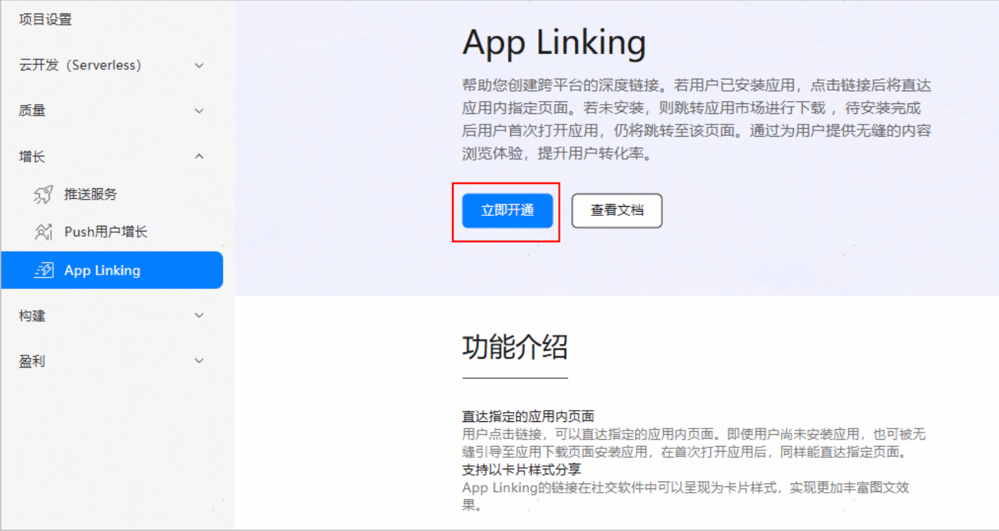

APP LInk接入效果：

[其他应用唤起爱企查.mp4](/video/other.mp4)

[h5唤起爱企查-未安装跳应用市场 (1).mp4](/video/h5%E5%94%A4%E8%B5%B7%E7%88%B1%E4%BC%81%E6%9F%A5-%E6%9C%AA%E5%AE%89%E8%A3%85%E8%B7%B3%E5%BA%94%E7%94%A8%E5%B8%82%E5%9C%BA_(1).mp4)

[h5唤起爱企查-已安装app (1).mp4](/video/h5%E5%94%A4%E8%B5%B7%E7%88%B1%E4%BC%81%E6%9F%A5-%E5%B7%B2%E5%AE%89%E8%A3%85app_(1).mp4)

# 1，APP Link介绍

App Linking是HarmonyOS系统层为开发者开放的统一链接能力。无论用户是否已经安装应用，都可以访问到链接对应的内容，实现一步直达的体验。

**说白了APP Link就是通过一个链接，直接拉起APP，但是APP Link有如下限制：**

1. 如果用户当前浏览的网页的域名与点击的App Linking链接的域名完全一致，则系统会继续在系统浏览器或ArkWeb中打开该链接，以维持连贯的用户浏览体验。
2. 如果域名不完全一致（[例如example.com和app.example.com](http://xn--example-ff6kt45e.xn--comapp-k76j.example.com/)），则系统会通过App Linking能力优先拉起目标应用，并在应用内展示相应的内容。

爱企查web端地址：[https://aiqicha.baidu.com](https://aiqicha.baidu.com/)

爱企查app link地址：[https://aqc.baidu.com](https://aqc.baidu.com/)

除了直接打开app的能力之外还支持两个能力

1，[直达应用市场能力](https://developer.huawei.com/consumer/cn/doc/AppGallery-connect-Guides/agc-applinking-appgallery-0000002236876696)：当应用未安装时，通过直达应用市场能力，可以实现在应用未安装时直接跳转应用市场。

2，[延迟链接能力](https://developer.huawei.com/consumer/cn/doc/AppGallery-connect-Guides/agc-applinking-deferredlink-0000002236716868)：（API15以上）当被分享用户未安装应用时，通过延迟链接能力，应用首次打开时，系统仍能获取用户之前点击的应用相关链接。在获取链接后，应用可直接跳转至对应的详情页，无需先跳转至应用首页。

# 2，APP Link接入流程

### 2.1，在AGC控制台开通App Linking服务



### 2.2，在后端服务器上进行配置

创建域名配置文件applinking.json，内容如下：

```
{
 "applinking": {
   "apps": [
     {
       "appIdentifier": "你的appid"
     }
   ]
 }
}

```

将配置文件放在域名服务器的固定目录下，**确保这个链接可以被访问到**：

[https://domain.name/.well-known/applinking.json](https://domain.name/.well-known/applinking.json%EF%BC%8C)

### 2.3，在AGC中创建appLink


### 2.4，配置项目的module.json5

```jsx
    "abilities": [
      {
        "name": "EntryAbility",
        "skills": [
          // 其中用于标识应用首页的skill中不要配置uris,否则影响接收push消息
          {
            "entities": [
              "entity.system.home"
            ],
            "actions": [
              "action.system.home"
            ]
          },
          {
            "entities": [
              "entity.system.browsable"
            ],
            "actions": [
              "ohos.want.action.viewData"
            ],
            "uris": [
              {
                "scheme": "https",
                "host": "aqc.baidu.com"
              }
            ],
            "domainVerify": true
          },
        ]
      }
    ],

```

# 3，测试app被拉起效果

对应用进行[手动签名](https://developer.huawei.com/consumer/cn/doc/harmonyos-guides/ide-signing#section297715173233)。必须使用手动签名，否则无法拉起应用。

测试方式1：在项目的h5中跳转appLInk

测试方式2：写一个Demo App使用鸿蒙的openLink API进行拉起（效果见上述视频：其他应用唤起爱企查）

```
      Button('点我打开爱企查', { type: ButtonType.Capsule, stateEffect: true })
        .width('87%')
        .height('5%')
        .margin({ bottom: '12vp' })
        .onClick(() => {
          let context = getContext(this) as common.UIAbilityContext;

          let appLink: string = "<https://aqc.baidu.com/m/downapp?naModule=home>";
          // 仅以App Linking的方式打开应用
          context.openLink(appLink, { appLinkingOnly: false })
            .then(() => {
              console.info('openlink success.');
            })
            .catch((error: BusinessError) => {
              console.error(`openlink failed. error:${JSON.stringify(error)}`);
            });
        }).alignRules({
        center: { anchor: '__container__', align: VerticalAlign.Center },
        middle: { anchor: '__container__', align: HorizontalAlign.Center }
      })

```

# 4，在应用中处理APP Link跳转

接入app link之后，我们还需要根据app link做一些跳转的处理，比如跳转到app指定的页面

```jsx
  const APP_LINK = '<https://aqc.baidu.com>';
  // 处理app冷启动
  async onCreate(want: Want, launchParam: AbilityConstant.LaunchParam): Promise<void> {
      if (want && want.uri?.startsWith(APP_LINK)) {
          // 处理Applink跳转
          appLinkHandle(want);
      }
  }
    // 热启动时
  onNewWant(want: Want): void {
        if (want && want.uri?.startsWith(APP_LINK)) {
          // 处理Applink跳转
          appLinkHandle(want);
          return;
        }
  }

```

```jsx
// 仅保留核心逻辑
export function appLinkHandle(want: Want) {
  const url = want.uri;
  // url 格式如下：
  // '<https://aqc.baidu.com/m/downapp?naModule=/aqc/person&naParam={%22personId%22:%22d8b80ae2201a5f40ec7bbb92f5f4a4dc%22}&h5Url=http%3A%2F%2F172.26.37.160%3A8977%2Fm%2Fperson%3FpersonId%3Dd8b80ae2201a5f40ec7bbb92f5f4a4dc&title=&fr=h5_xf_v2&channel=h5_xf_v2&isOpen=1&needLogin=1>';
  const uriInstance = new uri.URI(url);
  const naModule = uriInstance.getQueryValue("naModule");
  let naParam = uriInstance.getQueryValue("naParam");
  const h5Url = uriInstance.getQueryValue("h5Url");

  if (naModule) {
      // 有原生页面 跳转到原生页面
      getPageStack().pushPath({ name: 原生页, param: naParam });
  } else if (h5Url) {
    // 无原生页面 但有h5url 跳h5
    const param: webViewInterface = {
      url: h5Url
    };
    getPageStack().pushPath({ name: 'WebViewPage', param });
  } else {
    // 兜底跳到app首页，app默认就是首页，所以这里不需要跳转
  }
  const needLogin = uriInstance.getQueryValue("needLogin");
  const userInfo: UserInfo = AppStorage.get('userInfo') || {};
  if (needLogin && !userInfo.isLogin) {
    login();
    return;
  }
}

```

# 5，踩过的坑

1，跳转首页无限循环问题

原因：用Navgation路由包裹了首页，这个页面不能用路由跳转过去

解决方案：

1，打开app后不进行任何跳转；

2，用一个空白页面作为启动页，然后从启动页跳转到首页

参考文档：[https://developer.huawei.com/consumer/cn/doc/AppGallery-connect-Guides/agc-applinking-introduction-harmonyos-0000002017525936](https://developer.huawei.com/consumer/cn/doc/AppGallery-connect-Guides/agc-applinking-introduction-harmonyos-0000002017525936)