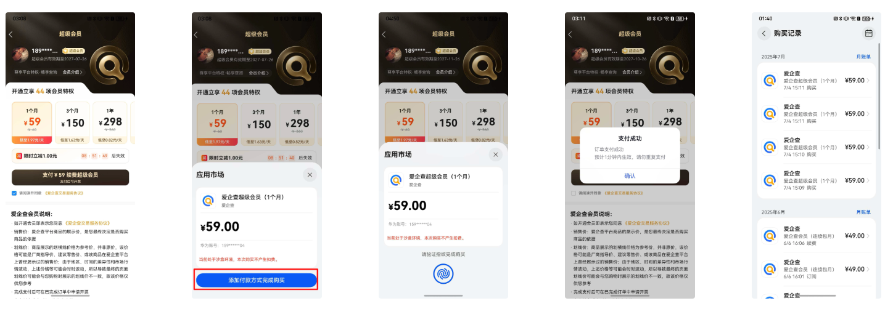

# 1，IAP简介

IAP Kit（华为应用内支付服务）为开发者提供便捷的应用内支付体验和接入流程；接入IAP Kit我们就不需要对接第三方支付如支付宝支付、微信支付。

我们不需要去对接华为IAP，收银台已经对接好了，我们只需要接入收银台SDK即可



# 2，接入前置步骤

## 2.1，PM侧接入流程

这几个是pm操作，主要是在AGC中进行一些配置

参考文档：[https://developer.huawei.com/consumer/cn/doc/app/digital-products-serve-0000001931836308](https://developer.huawei.com/consumer/cn/doc/app/digital-products-serve-0000001931836308)

### 2.1.1，开通商户服务

pm去AGC后台配置银行卡账户、币种等信息，用于开发者接收华为分成收益。


### 2.1.2， 打开IAP的开关


## 2.2 FE接入流程

pm、rd接入完成后fe再开始接入

### 1，配置应用身份信息

在AppScope/app.json5配置**bundleName**

```
{
  "app": {
    // bundleName需要与开发者在AppGallery Connect中创建应用时的包名保持一致
    "bundleName": "com.baidu.xxx",
  }
}

```

配置**client_id，在“entry/src/main/module.json5”的module**节点增加如下**client_id**属性配置，用于IAP Kit接口的应用身份鉴权。


```
"module":{
    "type": "***",
    "name": "***",
    // ...
    "metadata": [
      {
        "name": "client_id",
        "value": "123456"
      }
      // ...
    ]
}

```

### 2，配置手动签名

编辑器使用调试证书（不能使用自动签名证书，自动签名无法调起IAP）


申请调试证书文档：

[https://developer.huawei.com/consumer/cn/doc/app/agc-help-add-debugcert-0000001914263178](https://developer.huawei.com/consumer/cn/doc/app/agc-help-add-debugcert-0000001914263178)

### 3，配置沙盒账号

文档：[https://developer.huawei.com/consumer/cn/doc/harmonyos-guides/iap-sandbox](https://developer.huawei.com/consumer/cn/doc/harmonyos-guides/iap-sandbox)

配置成沙盒账号，支付不花钱

1. 华为手机中登录的账号是沙盒账号


在AppGallery中添加沙盒账号（如果没有添加账号的按钮说明账号的权限不够）


# 3，接入SDK

### 3.1 引入SDK @bdfeat-infra/poly-pay-sdk

```jsx
ohpm install @bdfeat-infra/poly-pay-sdk --registry <https://ohpm.baidu-int.com/repos/baidu>

```

### 3.2 配置以及初始化SDK

核心逻辑在37-60行

```jsx
import { common } from '@kit.AbilityKit';
import Cashier, { Env } from '@bdfeat-infra/poly-pay-sdk';
export class PaySdkManager {
  private static instance: PaySdkManager;
  private initialized: boolean = false;

  private constructor() {
  }

  public static getInstance(): PaySdkManager {
    if (!PaySdkManager.instance) {
      PaySdkManager.instance = new PaySdkManager();
    }
    return PaySdkManager.instance;
  }

  /**
   * 初始化支付SDK
   * @param context UIAbility上下文
   */
  public initialize(): void {
    if (this.initialized) {
      if (Cashier.appAbility?.bduss === (AppStorage.get("userInfo") as UserInfo)?.bduss) {
        console.log('initPaySdk 已经初始化过了');
        return;
      }
      console.log('initPaySdk bduss不一致 重新初始化');
    }

    const userInfo: UserInfo = AppStorage.get("userInfo") as UserInfo;
    const cuid = getCuid() as string;
    if (!cuid) {
      console.log('initPaySdk 失败 没有cuid');
      return;
    }
    // 设置上下文
    Cashier.context = getContext() as common.UIAbilityContext;

    // 设置环境
    Cashier.env = Env.ONLINE;

    Cashier.appAbility = {
      bduss: userInfo?.bduss || '',
      cuid: cuid,
      // 调试信息回调
      debugInfo: (info) => {
        console.log('PaySdk debug info:', JSON.stringify(info));
      }
    };

    Cashier.appRouter = {
      pop: (animated) => {
        // 全局唯一的NavPathStack
        getPageStack().pop(animated);
      },
      pushPathByName: (path, param, animated) => {
        // 全局唯一的NavPathStack
        getPageStack().pushPathByName(path, param, animated);
      }
    };

    this.initialized = true;
    console.log('initPaySdk 成功', cuid, userInfo?.bduss);
    console.log('initPaySdk Cashier.env', Cashier.env);
  }
}

```

```jsx
  async onCreate(want: Want, launchParam: AbilityConstant.LaunchParam): Promise<void> {
      // 此处省略其他业务逻辑...
      PaySdkManager.getInstance().initialize();
  }

```

### 3.3 调起支付

先调用业务接口下单，然后用拿到的参数调用收银台

```jsx
export async function appPayInfoAjax(payParams: AppPayInfoAjaxParams, callback?: PayCallBack) {
  // 调用业务接口
  newHttp.post<Record<string, Record<string, string> | string>>('/trade/getAppPayInfoAjax',
    params, {
      headers: {
        'Content-Type': 'multipart/form-data'
      }
    }).then((res) => {
        const iapParam: Record<string, string> = res.data as Record<string, string>;
        const context = getContext() as common.UIAbilityContext;
        // 调用收银台
        Cashier.startIapPay(context, iapParam as Record<string, string>, (info: PolyIapPayResult) => {
          console.log('Cashier.startIapPay', JSON.stringify(info));
          if (info.statusCode === PolyIapStatusCode.PAY_SUCCESS) {
            // 支付成功
          } else if (info.statusCode === PolyIapStatusCode.PAY_CANCEL) {
            // 支付取消
          } else {
            // 支付失败
          }
        });
  });
}

```

### 3.4 排查错误

调用IAP可能会遇到的错误状态码，可以参考华为文档里面的错误原因进行排查[https://developer.huawei.com/consumer/cn/doc/harmonyos-references/iap-error-code](https://developer.huawei.com/consumer/cn/doc/harmonyos-references/iap-error-code)


# 4，支付流程图


# 5，踩过的坑

1，axios版本和收银台sdk版本不兼容问题

问题现象：在支付时sdk内部偶尔会出现axios报错500，但是sdk给的结论是后端没问题

问题排查：爱企查axios版本是2.2.5，尝试删除axios依赖重新安装试试，还是有问题；了解到收银台sdk 里面也用到了axios 版本是2.2.4，怀疑可能是axios有什么冲突，因为手百也接入了支付，手百没有反馈过这个问题，所以将axios版本升级为2.2.6试试，升级之后测试支付没有出现过该问题，建议吧**axios的版本锁死成2.2.6**，版本号不要带^，否则安装依赖时会自动升级

问题预防：因为收银台sdk没有这块报错的日志，所以我们在支付失败的时候将错误日志进行上报，截止到7.11号，没有出现axios 500的错误

2，切换APP账号时要注意重新初始化sdk

切换账号用户的信息会变化，所以需要重新初始化sdk

参考文档：

1. [IAP Kit简介](https://developer.huawei.com/consumer/cn/doc/harmonyos-guides-V5/iap-introduction-V5)