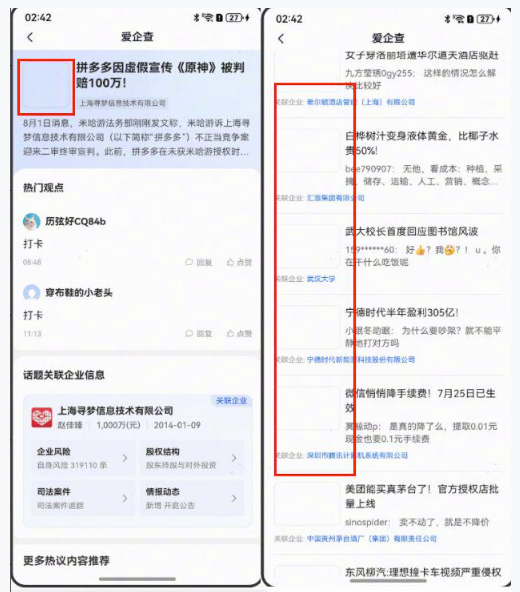
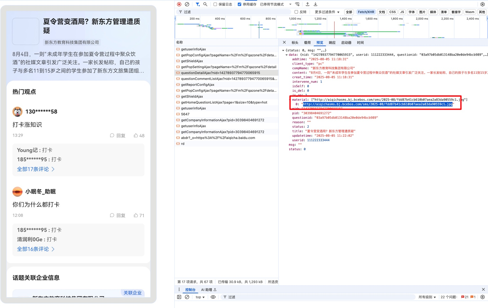

如上图，在鸿蒙手机内h5部分页面中的图片渲染不出来，一开始以为是图片地址有问题，但是安卓和IOS页面中的图片都能正常渲染，而且吧图片复制出来在浏览器图片可能正常展示，本地开发环境和测试环境h5图片也能正常加载，于是排除了图片地址的问题

思来想去，不知道如何查看，因为是线上环境没办法用charles抓包，既然没办法用charles，那能不能调试一下webview里面的h5，去华为官网搜了下，果然可以调试

通过浏览器调试工具，可以看到接口以及图片的信息，经过一番对比，发现只要是http协议的图片都不能加载出来



猜测可能是https的域名加载了http协议的图片，于是去查webview相关的文档，果然有个属性**`mixedMode`，**默认的**`mixedMode`**不能从https域名加载http协议的资源


于是将Web组件的`mixedMode`设置为`MixedMode.All`，图片就可以正常展示出来了

示例代码如下：

```jsx
import { webview } from '@kit.ArkWeb';

@Entry
@Component
struct WebComponent {
  controller: webview.WebviewController = new webview.WebviewController();
  @State mode: MixedMode = MixedMode.All;
  build() {
    Column() {
      Web({ src: 'www.example.com', controller: this.controller })
        .mixedMode(this.mode)
    }
  }
}
```